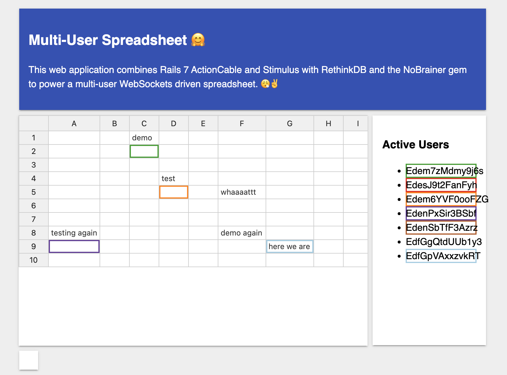

<h2>Multi User Spreadsheet </h2>
This Websockets driven application a collaborative spreadsheet application much like Google Sheets. It will broadcast to each user the selected cells in different colors, the data in the cells and will guard against multiple users editing the same cell.

<h3>DEPENDENCIES</h3>

| ***Technologies*** |                       ***Use***                       |
|--------------------|:-----------------------------------------------------:|
| Rails              |                 Application Framework                 |
| ActionCable        |           WebSockets for real-time features           |
| Stimulus           | JavaScript framework for enhancing HTML with behavior |
| RethinkDB          |         Open-source database for storing data         |
| Importmap          |        Simplifies JavaScript asset management         |
| Handsontable       |     JavaScript library to create editable tables      |


<h3>INSTALLATION</h3>
For an initial installation, execute these steps below:

1. **Clone Repository**
```
git@github.com:Badara-Senpai/spreadsheets.git
```


2. **Setting up Rethink DB**

As a prerequisite, first install RethinkDB by following one of the [installation guides](https://rethinkdb.com/docs/install/) for your operating system. Then open a new terminal and run rethinkdb to start the database system. You can visit http://localhost:8080 to browse around its administration interface.

RethinkDB pushes JSON to your apps in realtime. The easiest way of adding RethinkDB models to your Ruby on Rails application is by using the NoBrainer gem (already in the gemfile). It will take care of connections, and wrap your documents in objects with relations and attributes just like ActiveRecord does.

We will use NoBrainer instead of ActiveRecord. It will creates databases and tables for you automatically.


3. **Install dependencies**
```
bundle install
```

4. ***Here we go, now visit the application***

Open `http://localhost:3000` in your browser to start editing collaboratively.

## Usage
Open the application in multiple tabs or across different devices to test real-time syncing of spreadsheet edits.



